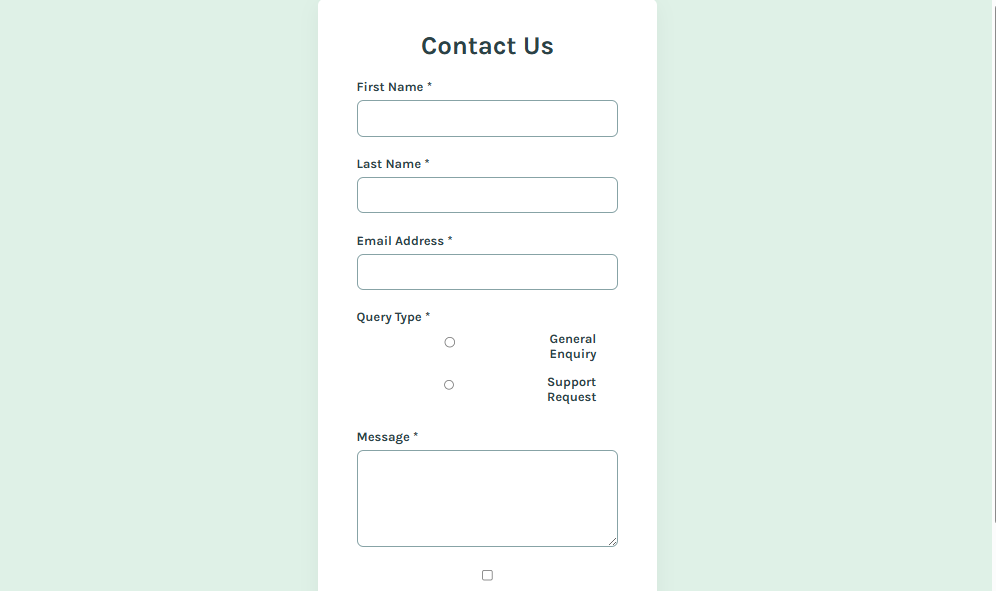

<!-- ✨ Animated Typing Intro -->
<h1 align="center">
  
</h1>

---

# Frontend Mentor - Contact Form Solution

This is a solution to the [Contact Form Challenge](https://www.frontendmentor.io/challenges/contact-form--G-hYlqKJj) on Frontend Mentor.  
Frontend Mentor challenges help you improve your coding skills by building realistic projects.

---

## 📋 Table of Contents

- [Overview](#overview)
  - [The Challenge](https://www.frontendmentor.io/challenges/contact-form--G-hYlqKJj)
  - [Screenshot](#screenshot)
  - [Links](https://fabian1ouis.github.io/contactform/)[Repository](https://github.com/fabian1ouis/contactform)
- [My Process](#my-process)
  - [Built With](#built-with)
  - [What I Learned](#what-i-learned)
  - [Continued Development](#continued-development)
  - [Useful Resources](#useful-resources)
- [Author](#author)

---

## 🧠 Overview

### The Challenge

Users should be able to:

- Complete the form and see a success toast message upon successful submission  
- Receive validation messages if:
  - A required field is missed  
  - The email address format is invalid  
- Navigate and complete the form using only the keyboard  
- Have all inputs, errors, and the success message announced to screen readers  
- View a responsive layout optimized for all devices  
- See hover and focus states for all interactive elements  

### 🖼️ Screenshot



---

### 🔗 Links

- **Solution URL:** [https://github.com/fabian1ouis/contact-form](https://github.com/fabian1ouis/contactform)  
- **Live Site URL:** [https://fabian1ouis.github.io/contact-form/](https://fabian1ouis.github.io/contactform/)

---

## ⚙️ My Process

### 🔧 Built With

- Semantic **HTML5** markup  
- **CSS3** custom properties (following official style guide)  
- **Flexbox** for layout  
- **JavaScript (ES6)** for form validation and accessibility  
- **Mobile-first workflow**  
- Accessible markup using **ARIA roles** and **aria-live** regions  

---

### 💡 What I Learned

This challenge helped me strengthen my understanding of:
- Building **accessible and screen-reader friendly forms** using ARIA attributes  
- Creating **custom validation** messages in JavaScript  
- Implementing a **success toast notification** with transitions  
- Designing layouts using **Flexbox** and CSS variables  
- Ensuring all elements are **keyboard-navigable** and meet WCAG accessibility standards  

Here’s a code snippet I’m proud of from my validation logic:

```js
if (field.value.trim() === "") {
  error.textContent = "This field is required";
} else if (id === "email" && !/^[^\\s@]+@[^\\s@]+\\.[^\\s@]+$/.test(field.value)) {
  error.textContent = "Please enter a valid email address";
}
